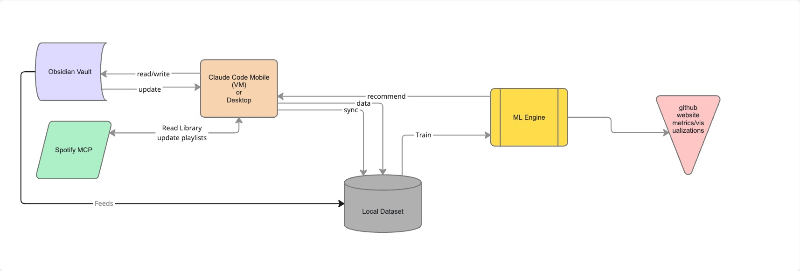
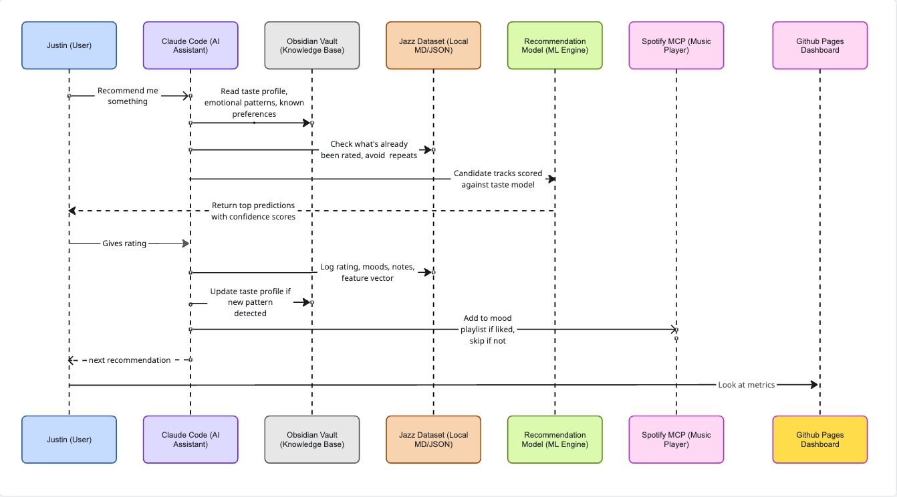

# Jazz Taste ML

A self-improving system that learns my jazz preferences from conversation and recommends new tracks I haven't heard yet — getting better with every rating.

Built with Claude Code, scikit-learn, and Spotify MCP.

## How It Works

I talk to Claude about jazz. Claude logs tracks with features (mood, energy, era, instrumentation, audio data from Spotify). A Random Forest model trains on the growing dataset and learns what I'll like. When I ask for a recommendation, Claude reads my taste profile, scores candidates against the model, and suggests tracks — no repeats, no generic playlists.

The feedback loop: **Listen → Rate → Log → Train → Recommend → Repeat.**

## System Architecture

The system connects six components:
- **Obsidian Vault** — stores the training dataset, taste profile, and model notes as markdown
- **Claude Code** — the orchestrator across mobile, VM, and desktop. Reads/writes the vault, logs tracks, triggers training, makes recommendations
- **Spotify MCP** — pulls audio features (duration, popularity) and manages playlists
- **Local Dataset** — JSON inside a markdown file, synced across devices via Obsidian
- **ML Engine** — scikit-learn pipeline (Ridge + Random Forest) with 75 features
- **GitHub Pages Dashboard** — interactive visualizations of the model's findings

## Recommendation Flow

1. I ask for a recommendation
2. Claude reads my taste profile and emotional patterns from Obsidian
3. Checks the dataset to avoid repeats
4. Scores candidate tracks against the trained model
5. Returns top predictions with confidence scores
6. I listen and give a rating
7. Claude logs the rating, moods, notes, and feature vector
8. Updates the taste profile if a new pattern is detected
9. Adds to Spotify playlist if liked
10. The model retrains on the expanded dataset

## The Dashboard

An interactive single-page dashboard with 20+ visualizations:

- Model performance metrics and history
- Taste clusters (PCA scatter)
- Feature importance rankings
- Predicted vs actual ratings
- Circle of Fifths analysis
- Artist journeys
- Mood x Rating heatmap
- Replayability vs Rating
- Hall of Fame (9s and 10s)
- Albums rated
- Rating by instrument and label (with track list dropdowns)
- [Attribute Dictionary](dictionary.html) — my personal taste vocabulary

## The Dataset

64 tracks, 3 albums, 22 artists. Average rating: 6.6/10.

The model currently uses 75 features across: energy, era, instrument, moods, subgenres, ensemble composition, record label, discovery source, audio features (from Spotify), artist history, and replayability.

## Tech Stack

- **ML:** scikit-learn (Ridge, Random Forest), LOO cross-validation
- **Data:** JSON embedded in Obsidian markdown
- **Dashboard:** Chart.js, vanilla HTML/CSS/JS
- **Integrations:** Spotify MCP, Claude Code agents
- **Hosting:** GitHub Pages (dashboard), local (model + data)
